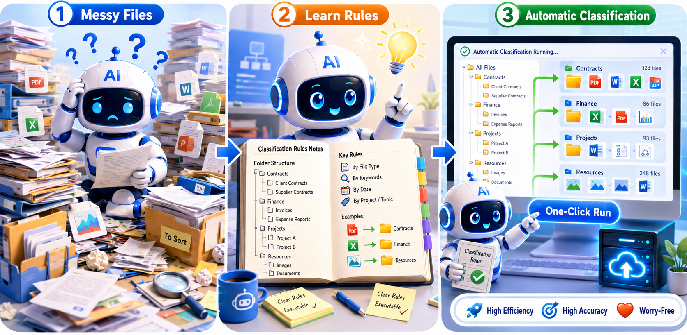

# Archive Classifier

<p align="center">
  
</p>

<p align="center">
  <a href="./README.md">简体中文</a> · <strong>English</strong>
</p>

To make full use of a frontier model's understanding, reasoning, and pattern-recognition abilities, this Skill follows a **model designs the rules; code runs them at scale** architecture. The model acts once as a classification-rule designer: it inspects the target taxonomy and the source data, then creates project-specific grouping and classification rules. Ordinary Python code applies those rules quickly, consistently, and repeatably at scale.

To understand how it works in more detail, send this prompt to your Agent:

```text
Read the current archive-classifier repository and explain its underlying design step by step in plain language. Focus on how the Agent analyzes the target taxonomy and source data, creates custom grouping and classification rules, and how Python applies those rules in a human-review loop.
```

To install it, send this prompt to your Agent:

```text
Go to https://github.com/misdolicc/archive-classifier and install and configure this Skill for yourself.
```

This is an [Agent Skill](./SKILL.md). `SKILL.md` is the concise operating procedure for Agents such as Codex, Claude Code, OpenCode, and TRAE.

This `README_EN.md` is for people. It explains what each step does, why the workflow is designed this way, and how to diagnose common problems.

---

## Table of contents

- [Core ideas](#core-ideas)
- [Project layout](#project-layout)
- [Complete workflow](#complete-workflow)
  1. [Inspect the source](#1-inspect-the-source)
  2. [Discover valid target leaves](#2-discover-valid-target-leaves)
  3. [Choose the classification granularity](#3-choose-the-classification-granularity)
  4. [Handle missing target categories](#4-handle-missing-target-categories)
  5. [Create the project driver](#5-create-the-project-driver)
  6. [Run classification and generate the plan](#6-run-classification-and-generate-the-plan)
  7. [Verify coverage](#7-verify-coverage)
  8. [Build the HTML review tool](#8-build-the-html-review-tool)
  9. [Run the optional review and reclassification loop](#9-run-the-optional-review-and-reclassification-loop)
  10. [Apply the reviewed move plan](#10-apply-the-reviewed-move-plan)
- [Key concepts](#key-concepts)
- [Windows and CJK path notes](#windows-and-cjk-path-notes)
- [Troubleshooting](#troubleshooting)

---

## Core ideas

1. **Files may go only into leaf nodes.** A leaf is a directory in the target taxonomy with no category subdirectories. Intermediate taxonomy nodes are never valid destinations.
2. **Keep related material together.** A datasheet and its 2D/3D models, a multi-part or multilingual manual, a vendor product folder, or a software package is one unit with one destination.
3. **Treat dumps as packages.** Installers, SDKs, driver and part libraries, runtime-data dumps (`.ors`, `.res`, `.dll`, `.bin`, installers, and logs), and complete equipment folders move as whole units rather than being exploded file by file.
4. **Inspect before guessing.** This applies to two decisions:
   - **Unit depth (`eff_depth`)**: inspect a branch with `units_lib.preview_depth(src, top)` before choosing the directory level that represents a complete package. Different subtrees under the same top-level folder may require different depths.
   - **Classification target (`classify`)**: if a path or filename is an opaque identifier and would otherwise fall back to `uncertain`, inspect a representative file when its contents are likely to resolve the ambiguity. Skip this when parent-folder or vendor context is sufficient, and skip it for whole software, driver, or library dumps that will remain intact anyway.

   These are one-time judgments made by the Agent while writing or refining `eff_depth()` and `classify()`. This is not a runtime pipeline that asks an AI model to inspect every file or directory.
5. **Surface uncertainty.** Anything sent to a generic `Other` leaf, or anything without a clean home, receives `status="uncertain"` and a short reason for human review.
6. **Produce a plan by default.** Files are not copied or moved unless the user explicitly requests it. Even then, `move_plan.py` starts with `DRY_RUN=True`.

---

## Project layout

```text
archive-classifier/
├── SKILL.md
├── README.md
├── README_EN.md
├── head-cn.png
├── head-en.png
├── scripts/
│   ├── units_lib.py
│   ├── classify_example.py
│   ├── verify_coverage.py
│   ├── build_review_html.py
│   ├── review_server.py
│   ├── reclassify.py
│   └── move_plan.py
└── templates/
    └── review.html
```

`units_lib.py` is the reusable engine. The other files are drivers and tools around it. A classification project normally creates one project-specific `run.py` by copying `classify_example.py` and implementing two functions:

- `eff_depth(parts) -> int`: decides at which directory level a branch becomes one indivisible unit.
- `classify(rel) -> (leaf, status, note)`: decides which target leaf receives that source unit.

The remaining files serve these roles:

- `verify_coverage.py`: checks coverage, destination validity, and duplicate units.
- `build_review_html.py`: builds the self-contained review page from `units.json` and the trusted leaf list.
- `review_server.py`: optional local backend for opening source units and submitting a reclassification queue.
- `reclassify.py`: reruns the project rules only for units marked for reclassification.
- `move_plan.py`: applies an approved plan by copying or moving whole units.
- `templates/review.html`: the review interface template.

---

## Complete workflow

The following sections use these example locations:

- Source: `E:/dump/2025-archive`
- Existing target taxonomy: `E:/knowledge-base`

### 1. Inspect the source

Do not print thousands of filenames. Start with a structural summary:

```python
import sys
sys.path.insert(0, "scripts")
import units_lib as U

print(U.summarize("E:/dump/2025-archive"))
```

Example result:

```python
{
    "total": 8342,
    "per_top": {
        "vendor-material": 5210,
        "software-installers": 2100,
        "misc": 1032,
    },
}
```

`summarize()` recursively counts the files under each top-level entry and sorts the result by size. This shows where most of the data lives and helps identify software or driver dumps that should be treated as packages.

### 2. Discover valid target leaves

Only target directories without category subdirectories are valid destinations. Always use `stable_leaf_dirs()` rather than calling `leaf_dirs()` directly:

```python
leaves = U.stable_leaf_dirs("E:/knowledge-base")
```

Example result:

```python
[
    "product-material/vendor-a/datasheets",
    "product-material/vendor-a/3d-models",
    "learning/other",
]
```

`leaf_dirs()` performs a live scan and defines a leaf as a directory with no subdirectories. That definition becomes unreliable after content folders have been copied into the target tree.

For example, suppose a product package named `A` was copied into the taxonomy leaf:

```text
product-material/vendor-a/datasheets/A
```

A new live scan would make two mistakes:

- `datasheets` now has a child directory, so it would no longer appear to be a leaf even though it is still the intended category.
- If `A` has no child directories, it would be mistaken for a new taxonomy leaf even though it is only archived content.

`stable_leaf_dirs()` prevents this. On first use, it scans the taxonomy and writes a persistent snapshot to:

```text
E:/knowledge-base/.archive_classifier_leaves.json
```

Later calls read that manifest instead of reinterpreting the live, content-mixed tree. Every destination produced by `classify()` must match an entry in this trusted list; `verify()` enforces that rule.

Use `leaf_dirs()` directly only when bootstrapping the manifest or diagnosing the current physical structure.

### 3. Choose the classification granularity

For large or mixed datasets, confirm the desired granularity with the user:

- **File level** works for a curated collection of a few hundred independent documents.
- **Package or folder level** is recommended for thousands of files, software packages, driver libraries, and equipment dumps.

The project expresses granularity through `eff_depth(parts)`. It tells `enumerate_units()` which directory level represents one complete unit.

Do not infer this level from the top-level folder name alone. First inspect the branch shape:

```python
U.preview_depth("E:/dump/2025-archive", "server-material")
```

Example result:

```python
{
    2: {
        "count": 3,
        "sample": [
            {"path": "server-material/model-a", "has_subdir": False},
            {"path": "server-material/model-b", "has_subdir": False},
            {"path": "server-material/model-c", "has_subdir": True},
        ],
    },
    3: {
        "count": 1,
        "sample": [
            {"path": "server-material/model-c/documents", "has_subdir": False},
        ],
    },
}
```

If most depth-2 directories are already complete packages, depth 2 is appropriate. If most still contain product or package divisions, use depth 3. Different subtrees can use different values:

```python
BASE = {
    "product-manuals": 3,
    "industry-equipment": 3,
    "learning": 2,
}


def eff_depth(parts):
    top = parts[0]
    if top == "server-material" and len(parts) > 1 and parts[1] == "model-c":
        return 3
    return BASE.get(top, 2)
```

The unit-enumeration algorithm works as follows:

- A directory becomes a unit root when its depth equals its configured effective depth.
- A shallower directory also becomes a unit root if it has no child directories and therefore cannot reach the configured depth.
- Once a directory is a unit root, none of its descendants can become another unit root.
- Files outside every unit root become individual loose-file units.

As a result, every source file belongs to exactly one unit.

### 4. Handle missing target categories

If the source contains material with no appropriate place in the target taxonomy, do not silently invent a category. Propose the missing category to the user and create it only after confirmation.

After creating a real new leaf, register it immediately:

```python
U.add_leaves("E:/knowledge-base", "industry-equipment/competitor-material")
```

`stable_leaf_dirs()` intentionally does not rescan the whole target tree to discover new leaves, because it cannot distinguish a newly created category from a content folder that was moved into an existing category. `add_leaves()` records that explicit intent safely.

Also confirm ambiguous category meanings with the user. For example, clarify whether “product information” means products under test, the user's own equipment, or competitor equipment before writing rules around that label.

### 5. Create the project driver

Copy [scripts/classify_example.py](scripts/classify_example.py) to a project-specific `run.py`, then edit its three marked sections.

**1. Paths and fallback leaf**

```python
SRC = "E:/dump/2025-archive"
DST = "E:/knowledge-base"
PLAN = "E:/dump/2025-archive_move_plan.txt"
JSONF = "E:/dump/2025-archive_units.json"
FALLBACK_LEAF = "learning/other"
```

`FALLBACK_LEAF` must be a real entry in the trusted target-leaf manifest.

**2. Unit depth**

Implement `eff_depth(parts)` based on the structural inspection from the previous step.

**3. Ordered classification rules**

Implement `classify(rel)` by scoping rules to a top-level source category and then refining with keywords. The first matching return wins:

```python
def classify(rel):
    parts = rel.split("/")
    top = parts[0]
    low = rel.lower()
    OK = lambda leaf: (leaf, "normal", "")
    UNC = lambda leaf, why="Needs human review": (leaf, "uncertain", why)

    if top == "vendor-material":
        if "semiconductor" in low:
            return OK("industry-equipment/semiconductor-test")
        return OK("industry-equipment/automotive-electronics-test")

    if top == "software-installers":
        if "driver" in low:
            return OK("software-and-drivers/device-drivers")
        return UNC("software-and-drivers/other", "Software type not recognized")

    return UNC(FALLBACK_LEAF, "No rule matched")
```

For opaque codes or generic filenames, decide whether opening a representative file is worthwhile:

- If parent-folder or vendor context is sufficient, do not open it.
- If identifiers follow a recognizable pattern, use a regular expression after examining a few samples.
- If the pattern is unclear, the cluster is small, and content would resolve the ambiguity, inspect a representative PDF or Word file and refine the rule or add an exact mapping.
- For whole software, driver, library, or equipment dumps, do not inspect every internal file; the package remains one unit regardless.

This is a one-time Agent judgment while authoring the driver, not an AI call for every item at runtime. Anything still unresolved should remain honestly marked `uncertain` for human review.

### 6. Run classification and generate the plan

```bash
PYTHONIOENCODING=utf-8 python run.py
```

The driver performs these steps:

1. `U.enumerate_units(SRC, eff_depth)` enumerates units and counts their files.
2. `U.build_rows(units, classify)` applies `classify()` once per unit.
3. `U.dump_json(rows, JSONF)` writes `units.json` for review and reclassification.
4. `U.write_plan(rows, PLAN, SRC, DST)` writes the human-readable move plan.
5. `U.verify(rows, SRC, DST)` runs the acceptance checks.

Each JSON row has this shape:

```json
{
  "src": "software-installers/device-driver-v2",
  "leaf": "software-and-drivers/device-drivers",
  "count": 214,
  "status": "normal",
  "note": ""
}
```

An uncertain row still has a legal destination but includes `status="uncertain"` and an explanation so that it is easy to find during review.

### 7. Verify coverage

The driver prints the verification result automatically. You can also check an existing `units.json` independently:

```bash
PYTHONIOENCODING=utf-8 python scripts/verify_coverage.py
```

All three acceptance checks must pass:

| Check | Meaning | Failure indicates |
|---|---|---|
| `coverage_ok` | Sum of all unit file counts equals the actual source file count | Files may have been omitted or counted incorrectly |
| `invalid_leaves` | Every planned destination exists in the trusted leaf list | A rule contains a wrong path or the taxonomy lacks that leaf |
| `duplicate_units` | No source unit appears more than once | Unit enumeration or plan data is inconsistent |

Only 100% coverage, zero invalid leaves, and zero duplicate units count as **PASS**. `uncertain` rows are allowed: they are technically valid rows that still require a semantic decision from a person.

Destination validation uses `stable_leaf_dirs()`, so previously archived content cannot corrupt the result.

### 8. Build the HTML review tool

```bash
PYTHONIOENCODING=utf-8 python scripts/build_review_html.py
```

Edit the constants at the top of `build_review_html.py`:

```text
UNITS / SRC / DST / OUT / NAME / BIG / COPY_BACKEND
```

The builder injects the trusted leaf list, units, and metadata into `templates/review.html`, producing one self-contained HTML file with no runtime dependencies.

With `COPY_BACKEND=True` (the default), it also copies `review_server.py` next to the output HTML. The workspace then contains the review page, JSON, plan, and optional backend without depending on the Skill's original directory.

The review page supports:

- Search, top-level filtering, source or target grouping, and sorting by path or file count.
- Filters for uncertain, edited, reviewed, unreviewed, large-package, and reclassification states.
- Editing targets with leaf autocomplete and invalid-target validation.
- Per-row review state and an overall progress indicator.
- Marking rows that need reclassification.
- Exporting a reviewed text plan or CSV.
- Saving progress in browser `localStorage`, isolated by dataset name.

Opening the page through `file://` supports normal review, editing, and export. Opening source units and submitting a reclassification queue require the optional local backend.

### 9. Run the optional review and reclassification loop

```bash
PYTHONIOENCODING=utf-8 python scripts/review_server.py ./review.html
```

`review_server.py` is a minimal standard-library HTTP server bound only to `127.0.0.1`. It reads the embedded metadata and opens the browser automatically.

When served through the backend:

- Clicking a source path opens that file or folder read-only in the operating system's default viewer. The server confines resolved paths to the configured source root.
- Submitting rows marked for reclassification writes `<name>_reclassify_queue.json`.

The reclassification loop is:

1. Mark incorrect rows as needing reclassification and submit the queue.
2. Improve `classify()` in `run.py`.
3. Run:

   ```bash
   PYTHONIOENCODING=utf-8 python scripts/reclassify.py
   ```

4. Refresh the review page.

`reclassify.py` processes only queued units. It updates `leaf`, `status`, and `note`, increments each processed unit's `rev`, rebuilds the HTML, and archives the consumed queue as `.done`. A higher `rev` tells the browser to discard stale local review state for those units so they return to the review queue with fresh results.

The `OVERRIDES` dictionary also supports one-off manual destinations without changing the general rules.

### 10. Apply the reviewed move plan

Do this only when the user explicitly asks to apply an approved plan. Export the reviewed text plan from the HTML page, configure `move_plan.py`, and run:

```bash
PYTHONIOENCODING=utf-8 python scripts/move_plan.py
```

Important settings:

```python
PLAN = "E:/dump/2025-archive_move_plan_reviewed.txt"
MODE = "copy"
DRY_RUN = True
```

Always run with `DRY_RUN=True` first. It prints and logs every planned operation without changing files. Set it to `False` only after reviewing the preview.

Execution guarantees include:

- **Whole-unit operations:** packages and folders are copied or moved intact.
- **Conflict safety:** an existing name receives ` (2)`, ` (3)`, and so on; existing content is never overwritten or merged.
- **Destination validation:** every destination is checked against `stable_leaf_dirs()`, with case and path-separator normalization.
- **Explicit category creation:** if `CREATE_MISSING_LEAVES=True` creates a missing category, it also registers it through `add_leaves()`.
- **Auditability:** completed, skipped, and failed operations are summarized and written to `<plan>_move_log.txt`.

---

## Key concepts

| Concept | Meaning |
|---|---|
| **Unit** | The smallest indivisible classification object: a software package, product folder, or loose file. |
| **Leaf** | A terminal category in the target taxonomy and the only valid archive destination. |
| **Trusted leaf manifest** | `.archive_classifier_leaves.json`, a persistent snapshot of the taxonomy's real leaves that is not confused by content copied into them. |
| **Unit depth (`eff_depth`)** | The source-directory level at which a branch becomes one complete unit. |
| **Depth preview (`preview_depth`)** | A sampled view of directories at each depth and whether they still contain subdirectories. |
| **Coverage verification (`verify`)** | Checks that every source file is accounted for, every target is valid, and no source unit is duplicated. |
| **Revision (`rev`)** | Per-unit classification version; incrementing it resets stale browser review state after reclassification. |
| **`status: uncertain`** | Marks a valid but semantically unresolved classification for focused human review. |

---

## Windows and CJK path notes

These notes matter primarily on Windows when source or target paths contain Chinese, Japanese, or Korean characters:

- Run scripts with `PYTHONIOENCODING=utf-8` to avoid console encoding failures.
- Git Bash can corrupt CJK text passed through command-line arguments or here-documents. Put CJK paths in the scripts' UTF-8 **EDIT-ME** constants and run the script file instead.
- Use POSIX-style `/` as the canonical path separator. It is valid on Windows, and the review interface normalizes pasted separators and case when matching destinations.

---

## Troubleshooting

- **`verify()` reports `invalid_leaves`:** compare destinations from `classify()` with `units_lib.stable_leaf_dirs(DST)`. Look for spelling errors, intermediate nodes, missing categories, or newly created leaves that were not registered with `add_leaves()`.
- **`coverage_ok` is `False`:** inspect the units returned by `enumerate_units()` and verify that `eff_depth()` matches the actual branch shapes.
- **A branch is grouped too coarsely or too finely:** use `preview_depth(SRC, branch)` and refine `eff_depth(parts)`, including rules based on `parts[1]` or deeper when one branch is structurally mixed.
- **A newly created leaf is absent from classification and review:** call `units_lib.add_leaves(DST, new_leaf)` and rebuild the plan or review page. A deliberate new category is not discovered by rescanning.
- **The trusted manifest looks wrong:** inspect `DST/.archive_classifier_leaves.json`. If its initial snapshot was created from an already content-mixed tree, correct it manually or remove it only after restoring or confirming a clean taxonomy skeleton, then bootstrap it again.
- **The target input stays red in the review page:** choose a real leaf from autocomplete, or register a newly created category with `add_leaves()` and rebuild the page.
- **Opening a source or submitting reclassification does nothing:** serve the page with `review_server.py`. In raw `file://` mode, the page degrades gracefully by showing a backend hint or downloading the queue JSON.
- **`move_plan.py` prints many `SKIP invalid leaf` messages:** the reviewed plan contains destinations absent from the trusted manifest. Register legitimate new categories, or use `CREATE_MISSING_LEAVES=True` cautiously.
